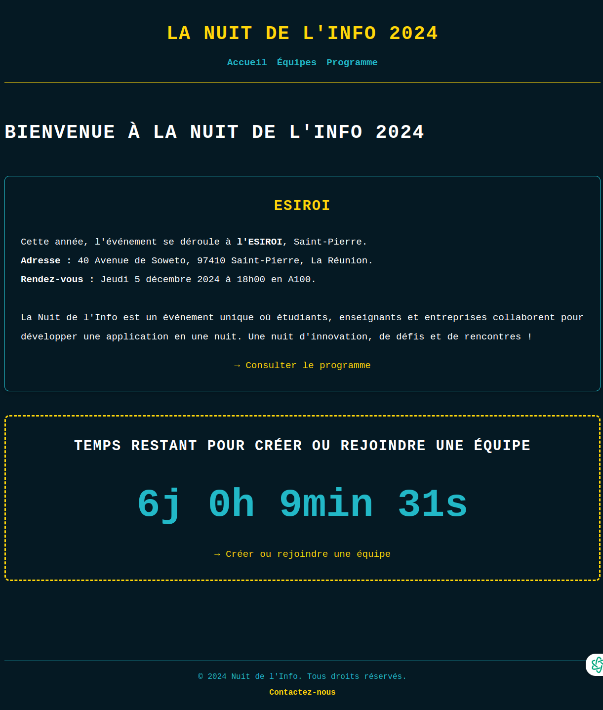
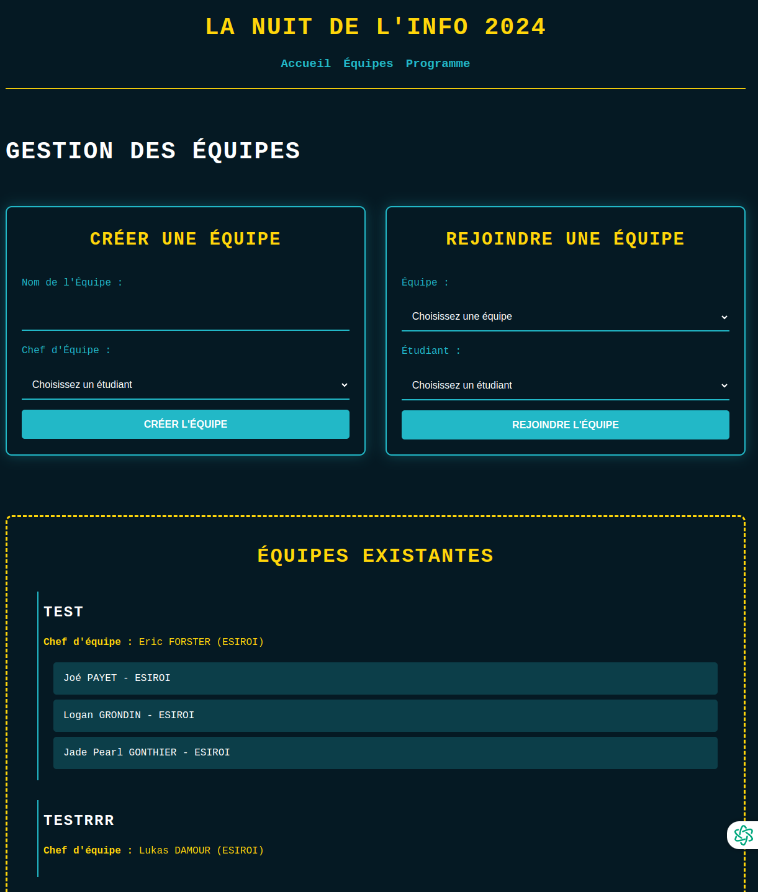
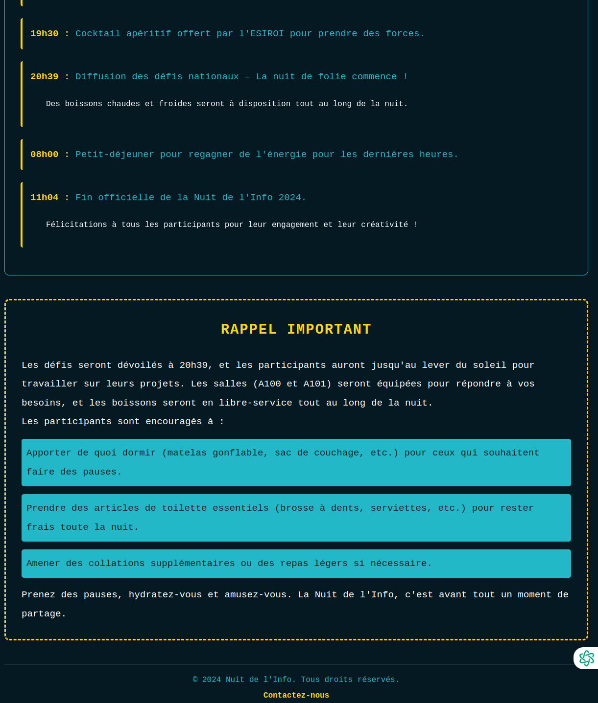

# Project Description for "Nuit de l'Info - ESIROI 2024"

## Goal of the project:

- Promote the event across the University of La Réunion.
- Facilitate the creation of teams and ensure smooth communication between participants.
- Organize the hackathon program, including the schedule, activities, and support for participants.

## Project Structure:

```csharp
nuit_info/
│
├── app/
│   ├── __init__.py          # Flask initialization
│   ├── routes.py            # Application routes
│   ├── models.py            # Data management (SQLite with SQLAlchemy)
│   ├── templates/           # HTML pages
│   │   ├── base.html        # Base template
│   │   ├── home.html        # Homepage
│   │   ├── teams.html       # Team management
│   │   └── program.html     # Program page
│   └── static/              # CSS, JS files
│       ├── styles.css       # Application styles
│       └── script.js        # JS scripts
│
├── app.db                   # SQLite database
├── run.py                   # Main file to run Flask
└── requirements.txt         # Python dependencies
```

## Installation instructions: 

1. Install Flask et SQLAlchemy :
```bash
pip install flask flask-sqlalchemy flask-wtf
```

2. Create a requirements.txt file:
```bash
flask
flask-sqlalchemy
flask-wtf
```

3. Install dependencies with:
```bash
pip install -r requirements.txt
```

## Screenshot application 








I Participated and organized the "Nuit de l'Info - ESIROI 2024," a 24-hour hackathon to develop innovative digital solutions.
I Promoted the event within the University of La Réunion, helped create teams, and managed the program schedule.

Lise Rochat - 2024 